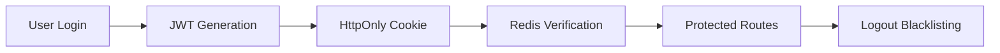
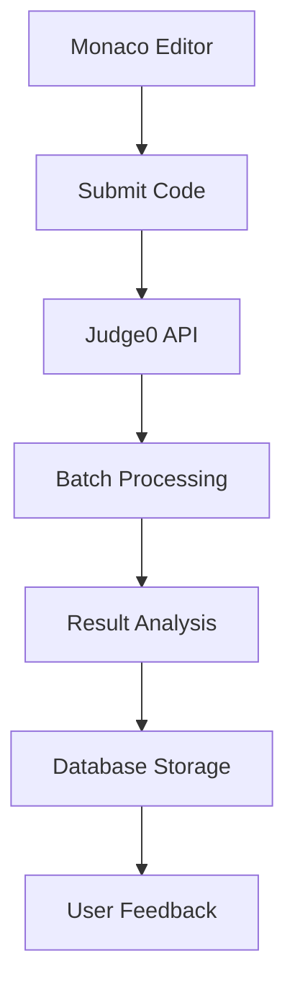
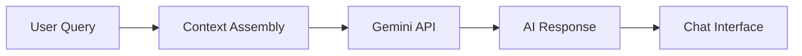

<div align="center">

# SEGFAULT
### The Ultimate AI-Powered Coding Practice Platform

<p align="center">
  <strong>Master Data Structures & Algorithms with AI-powered tutoring, real-time code execution, and expert video solutions</strong>
</p>

<p align="center">
  <a href="https://segfault-frontend-1.netlify.app" target="_blank">
    
  </a>
</p>

<p align="center">
  
  
  
  
  
</p>

</div>

## Table of Contents
- [Live Demo](#live-demo)
- [About](#about)
- [Features](#features)
- [Architecture](#architecture)
- [Tech Stack](#tech-stack)
- [Getting Started](#getting-started)
- [API Reference](#api-reference)
- [Contributing](#contributing)
- [License](#license)

## Live Demo

🚀 **[Check out the live application here!](https://segfault-frontend-1.netlify.app)**

Experience SEGFAULT in action - solve problems, chat with AI, and see real-time code execution.

## About

SEGFAULT is a comprehensive platform that bridges the gap between learning and mastering Data Structures & Algorithms. Unlike traditional platforms, SEGFAULT provides:

- **AI-Powered Tutoring** - Contextual help from Google Gemini
- **Real-Time Code Execution** - Instant feedback with visible test cases
- **Comprehensive Judging** - Submit against hidden test cases
- **Video Solutions** - Expert explanations for complex problems
- **Secure Architecture** - Enterprise-grade authentication

Perfect for technical interview preparation and competitive programming practice.

## Features

### For Developers
- **Monaco Editor Integration** - Professional code editing in C++, Java, JavaScript
- **Instant Code Testing** - Run code against visible test cases
- **Smart Submission System** - Evaluate solutions against comprehensive hidden tests
- **AI Code Assistant** - Get hints, reviews, and explanations from Gemini AI
- **Progress Tracking** - Detailed submission history and performance analytics
- **Advanced Filtering** - Find problems by difficulty, tags, and solve status
- **Video Editorials** - High-quality solution explanations

### For Administrators
- **Complete Problem Management** - Full CRUD operations for coding problems
- **Secure Admin Dashboard** - Protected administrative interface
- **Video Upload System** - Cloudinary-powered video management with progress tracking
- **Role-Based Access Control** - Secure endpoint protection
- **Centralized Content Management** - Single interface for platform content

## Architecture

### Authentication Flow


### Code Execution Pipeline


### AI Tutor Integration


The system architecture ensures:
- **Secure Authentication** - JWT tokens with Redis blacklisting for instant logout
- **Efficient Code Execution** - Judge0 API handles batch processing and result polling
- **Context-Aware AI** - Gemini receives full problem context for relevant tutoring
- **Scalable Design** - Separated concerns with clear data flow

## Tech Stack

| **Frontend** | **Backend** | **Database** | **Services** |
|:---:|:---:|:---:|:---:|
| React.js | Node.js | MongoDB | Judge0 API |
| Redux Toolkit | Express.js | Mongoose | Google Gemini |
| Vite | JWT Auth | Redis | Cloudinary |
| Tailwind CSS | bcrypt |  |  |
| Monaco Editor |  |  |  |

## Getting Started

### Prerequisites
- Node.js v18.x or higher
- MongoDB instance (local or cloud)
- Redis instance (local or cloud)

### Backend Setup
```bash
# Clone the repository
git clone https://github.com/your-username/segfault-repo.git
cd segfault-repo/backend

# Install dependencies
npm install

# Create environment file
cp .env.example .env
```

Configure your `.env` file:
```env
PORT=3000
DB_CONNECT_STRING=your_mongodb_connection_string
REDIS_PASS=your_redis_password
JWT_KEY=your_jwt_secret_key
JUDGE0_KEY=your_judge0_rapidapi_key
GEMINI_KEY=your_google_gemini_api_key
CLOUDINARY_CLOUD_NAME=your_cloudinary_cloud_name
CLOUDINARY_API_KEY=your_cloudinary_api_key
CLOUDINARY_API_SECRET=your_cloudinary_api_secret
```

```bash
# Start the server
npm start
```

### Frontend Setup
```bash
# Navigate to frontend directory
cd ../frontend

# Install dependencies and start
npm install
npm run dev
```

## API Reference

### Authentication
| Method | Endpoint | Description | Auth |
|:---:|:---|:---|:---:|
| `POST` | `/user/register` | Register new user | No |
| `POST` | `/user/login` | User login | No |
| `POST` | `/user/logout` | Logout user | Yes |
| `GET` | `/user/check` | Check auth status | Yes |

### Problem Management
| Method | Endpoint | Description | Role |
|:---:|:---|:---|:---:|
| `POST` | `/problem/create` | Create new problem | Admin |
| `PUT` | `/problem/update/:id` | Update existing problem | Admin |
| `DELETE` | `/problem/delete/:id` | Delete problem | Admin |
| `GET` | `/problem/problemById/:id` | Get single problem | User |
| `GET` | `/problem/getAllProblem` | Get all problems | User |
| `GET` | `/problem/problemSolvedByUser` | Get user's solved problems | User |

### Code Submission
| Method | Endpoint | Description | Auth |
|:---:|:---|:---|:---:|
| `POST` | `/submission/run/:id` | Test code with visible cases | Yes |
| `POST` | `/submission/submit/:id` | Submit for final judging | Yes |
| `GET` | `/problem/submittedProblem/:pid` | Get submission history | Yes |

### AI & Media
| Method | Endpoint | Description | Role |
|:---:|:---|:---|:---:|
| `POST` | `/ai/chat` | Chat with AI tutor | User |
| `GET` | `/video/create/:problemId` | Get video upload signature | Admin |
| `POST` | `/video/save` | Save video metadata | Admin |
| `DELETE` | `/video/delete/:problemId` | Delete video solution | Admin |

## Architecture Overview

### Authentication Flow
1. User credentials are validated and JWT tokens are issued as httpOnly cookies
2. Protected routes use middleware to verify JWT signatures
3. Redis maintains a blacklist of invalidated tokens for secure logout
4. Role-based access control separates user and admin functionalities

### Code Execution Pipeline
1. User submits code through Monaco Editor
2. Backend processes submission and sends to Judge0 API
3. Results are polled, processed, and stored in MongoDB
4. Detailed feedback is returned to the user interface

### AI Integration
The Gemini AI tutor receives full problem context including:
- Problem description and constraints
- User's current code and conversation history
- Contextual hints and educational guidance

## Contributing

1. Fork the repository
2. Create your feature branch (`git checkout -b feature/new-feature`)
3. Commit your changes (`git commit -m 'Add new feature'`)
4. Push to the branch (`git push origin feature/new-feature`)
5. Open a Pull Request

## License

This project is licensed under the MIT License - see the [LICENSE](LICENSE) file for details.

---

<div align="center">

**Built for developers, by developers**

</div>
